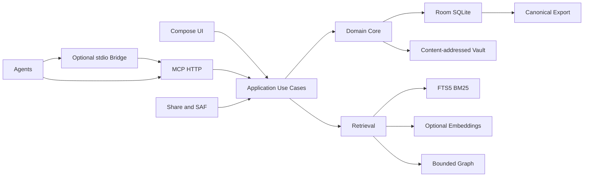

# Architecture

## System shape



## Packages

```text
app/                      Application and container
domain/model/             Pure Kotlin records/value objects
domain/repository/        Repository interfaces
domain/service/           Supersession/context/policies
data/db/                   Room entities/DAOs/migrations
data/vault/                Blobs/checksums/archive safety
data/index/                Scanner/chunkers/FTS/embeddings
data/export/               Canonical JSON/Markdown
retrieval/                 Candidates/fusion/filters/packer
mcp/                       Server/schemas/tools/resources/prompts
platform/saf/              ContentResolver/Documents
platform/service/          Foreground MCP service
platform/work/             WorkManager jobs
ui/                        Compose/navigation/ViewModels
```

## Layer rules

- Domain imports no Android, Room, Ktor, MCP, or model provider.
- Data implements domain repositories.
- Retrieval uses abstract lexical/vector/graph interfaces.
- MCP maps DTOs to application commands; never calls DAOs.
- UI and MCP share use cases/policies.
- Every mutation is transactional and emits provenance.
- Long work is idempotent, cancellable, progress-reporting.

## Runtime

One Room database with `projectId` scope, WAL, explicit migrations. Do not create uncontrolled per-project databases. Export canonical records, not a live WAL copy.

Vault path: `files/vault/sha256/<prefix>/<hash>`. Stream to temp, hash, close/sync, atomically rename. Deduplicate bytes; retain size/MIME/original name/reachability metadata. Never directly extract untrusted archives to final paths.

MCP: official Kotlin SDK, Ktor CIO, `/mcp`; default bind `127.0.0.1`, LAN/VPN only by explicit action. Authentication middleware runs before dispatch. UI/server share one application container/database.

WorkManager handles deferred indexing/integrity/cleanup. A foreground service handles explicitly active serving or a long user-visible operation. Neither hides an always-on daemon.

## Concurrency

- One database singleton.
- Transactional writes; project-level indexing mutex/idempotency key.
- Reads see committed state during indexing.
- Version activation and old projection removal are atomic.
- Context packs capture snapshot time and source hashes.

Safe preferences use DataStore. Credentials/tokens use Keystore-backed encryption and never appear in source, exports, logs, previews, or client config committed to Git.
